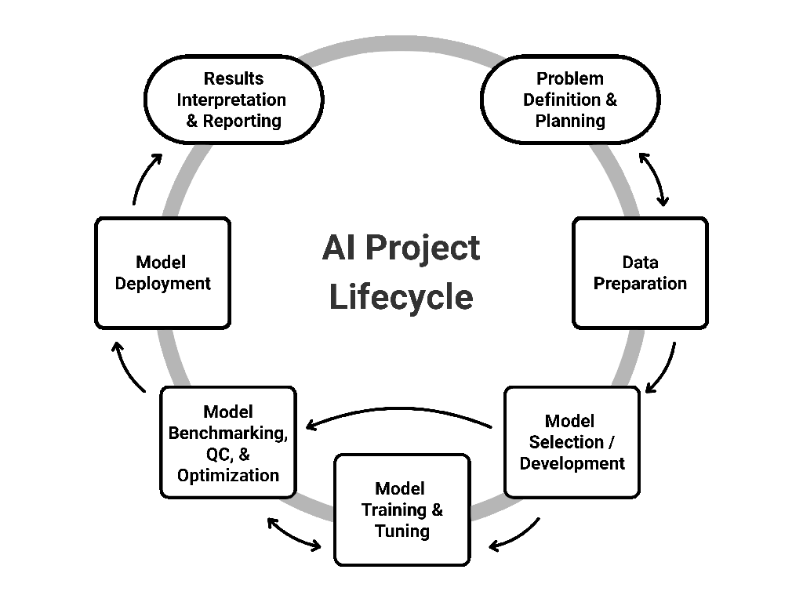

# CaRCC AI Facilitation Handbook

*Working document — CaRCC AI Facilitation Materials.* Source: [RCD Taxonomy of
AI
Tasks](https://docs.google.com/presentation/d/1yiS4N5-iDLyFCJFe3XOI-M1yUq6akfSDH-Gl_yzm3kU/).

## Introduction

Research Computing and Data (RCD) professionals encompass a broad community of
roles supporting research infrastructure and workflows, from system
administrators and research software engineers to data scientists and security
specialists. Among them, RCD facilitators play a particularly critical role in
connecting exploratory research to reliable, sustainable outcomes, collaborating
with researchers, educators, students, staff, and external partners to co-create
solutions that address complex computing and data needs
[@alberAIProjectFacilitation2025; @schmitzAdvancingWorkforceThat2021]. In a
landscape increasingly defined by the rapid growth and change brought upon by
Artificial Intelligence (AI) and growing institutional demands to support that,
the necessity for a structured AI integration within RCD is echoed across
national organizations and initiatives such as CASC, the NSF AI Institutes, the
NAIRR Pilot, and ACCESS. Collectively, these entities emphasize the need for
strategic investments in cyberinfrastructure, workforce development, policy
frameworks, and sustainable practices to enable effective, responsible AI
adoption at scale [@boernerACCESSAdvancingInnovation2023;
@bulekovaDynamicStateAI2024; @donlonNationalArtificialIntelligence2024;
@StrengtheningDemocratizingUS2023; @USNAIRRPilot2024].

To address the community needs, we surveyed the Campus Research Computing
Consortium (CaRCC) AI Facilitation Interest Group [@CaRCCAIFacilitationIG].
While the 23 completed responses represented a focused subset of the broader
CaRCC community, the results clearly highlighted current RCD priorities.
Respondents ranked AI infrastructure and MLOps as their highest priorities,
followed by career development for facilitators and data management (FAIR
principles). Areas such as AI governance, ethics, and compliance;
domain-specific AI case studies; and generative AI tools for research support
were ranked lower but still valued. These findings indicate that while RCD
professionals primarily focus on strengthening technical infrastructure and
operational readiness, they also recognize that sustained facilitation, ethical
guidance, and professional development are essential for long-term maturity.

Building on these insights and our prior work regarding an AI project lifecycle
framework [@alberAIProjectFacilitation2025], this work offers a
practitioner-oriented guide to the tools and processes applicable at each stage
of an AI project. It is supported in part by NSF OAC Award No. 2436057 and has
been developed using a qualitative document-analysis methodology drawing on
peer-reviewed literature, authoritative white papers, and institutional
frameworks [@bowenDocumentAnalysisQualitative2009]. We applied triangulation to
compare multiple credible sources and conducted member checking with RCD
practitioners in the CaRCC AI Facilitation Working Group
[@CaRCCAIFacilitationWG] to refine clarity and real-world applicability.

The resulting guide provides a structured, end-to-end facilitation reference for
AI projects through the lens of RCD facilitators. Here, we use "AI" as a generic
term to cover both Artificial Intelligence- and Machine Learning- (ML) based
projects. Because AI impacts a wide range of research domains, it is essential
to utilize a lifecycle model that generalizes across diverse real-world use
cases. Our framework (Figure 1) maps each stage of a standardized AI
workflow—spanning problem definition and planning, data preparation, model
development, training and tuning, benchmarking, deployment, and reporting—to
specific tools and decision points. Within this scope are the critical
facilitation activities that connect research intent to practice, including
resource brokerage (compute, storage, network, software), governance and
compliance (DUA, IRB, CUI/PHI), risk and cost management, and practices for
reproducibility and security. Any deep dives into AI/ML mathematics or
domain-specific scientific theory is out of scope for this document. The intent
is to keep the focus on *practical facilitation*. In this context, we define a
researcher role to be someone who drives the scientific inquiry, provides domain
expertise, and defines the core research problem and interpretation of the
output. An RCD facilitator, by contrast, bridges research and technology,
translating scientific problems into technical requirements, brokering the
compute, storage, and software resources a project needs and connecting
researchers to the broader RCD professionals and institutional offices
responsible for infrastructure, security, and compliance.

This guide could serve as a starting point for RCD facilitators familiar with
high performance computing and shared AI platform infrastructure, at a beginner
to intermediate level, as well as researchers interested in executing their
AI-based workflow on shared resources. In that context, this guide is most
useful for RCD practitioners, and also valuable for researchers looking to
understand infrastructure constraints and best practices.

Through this guide, we aim to empower research teams to move from exploratory AI
ideas to reliable, reproducible, scalable, and sustainable outcomes while
balancing performance, cost, and the responsible use of shared resources. It is
a co-creation model where researchers and RCD Facilitators interact continuously
to balance performance, cost, security, and responsible use of shared resources.
The remainder of this document details the constituent stages of the AI project
lifecycle, introducing concrete implementation strategies that RCD facilitators
can adopt, beginning with the foundational stage of any AI workflow: Problem
Definition & Planning.

**Figure 1:** Conceptual illustration of AI project lifecycle stages from
inception to completion.

## The lifecycle stages

1. [Problem Definition and RCD Resource Planning](problem-definition.md)
2. [Data Preparation](data-preparation.md)
3. [Model Selection and/or Development](model-selection.md)
4. [Model Training and Tuning](model-training.md)
5. [Model Benchmarking, Quality Control, and Optimization](benchmarking.md)
6. [Model Application](model-application.md)
7. [Results Interpretation and Reporting](results-reporting.md)
8. [Cross-Cutting Considerations](cross-cutting.md)
